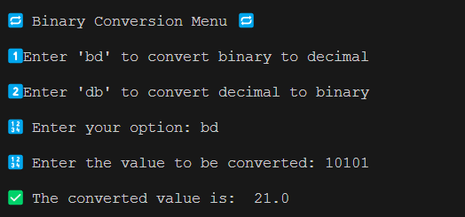
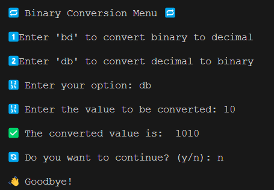
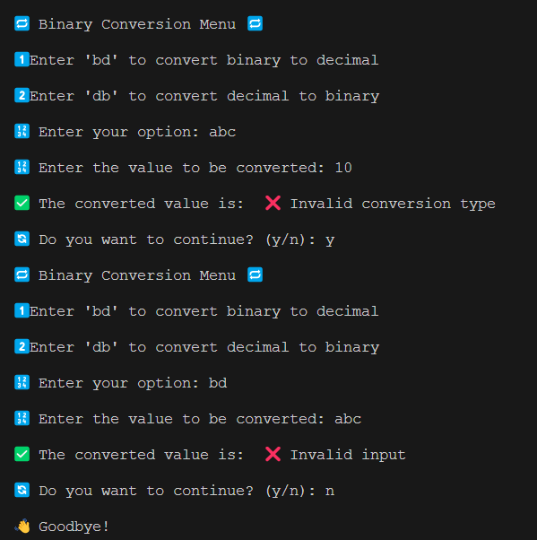

# HW.8 Binary Conversion

This program allows you to convert numbers between binary and integer representations. 

 

## Function Overview

The `bin_converter` function is the core of this program. 

It takes two parameters: `conversion_type` and `input_value`.

- `conversion_type`: This parameter determines the type of conversion to be performed. It accepts two values: 'bd' for binary to integer conversion, and 'db' for integer to binary conversion.

- `input_value`: This is the value to be converted. It should be a positive integer.

 

The function performs a series of checks and operations:

1. It checks if the `conversion_type` is valid. If not, it returns an error message.

2. It checks if the `input_value` is a valid positive integer. If not, it returns an error message.

3. If the `conversion_type` is 'bd', it converts the binary `input_value` to a integer.

4. If the `conversion_type` is 'db', it converts the integer `input_value` to a binary number.

 

**Examples:**

**1) Binary to Integer**

Input: `binary_con('bd', 1001)` 

Output: This will return `9`, because `1001` converts to the integer `9`.

 

**2) Integer to Binary**

Input: `binary_con('db', 8)` 

Output: This will return `1000`, because `8` converts to the binary number `1000`.

 

## Expected Output

#### Binary to Integer Conversion

#### Integer to Binary Conversion

## Handling Errors

The program expects valid inputs, such as 'bd' or 'db' for the operation and a positive integer for the value to be converted. 

If an invalid input is provided, the program must be able to handle the errors as shown below.

# Be Creative! Make the UI your own. :)
